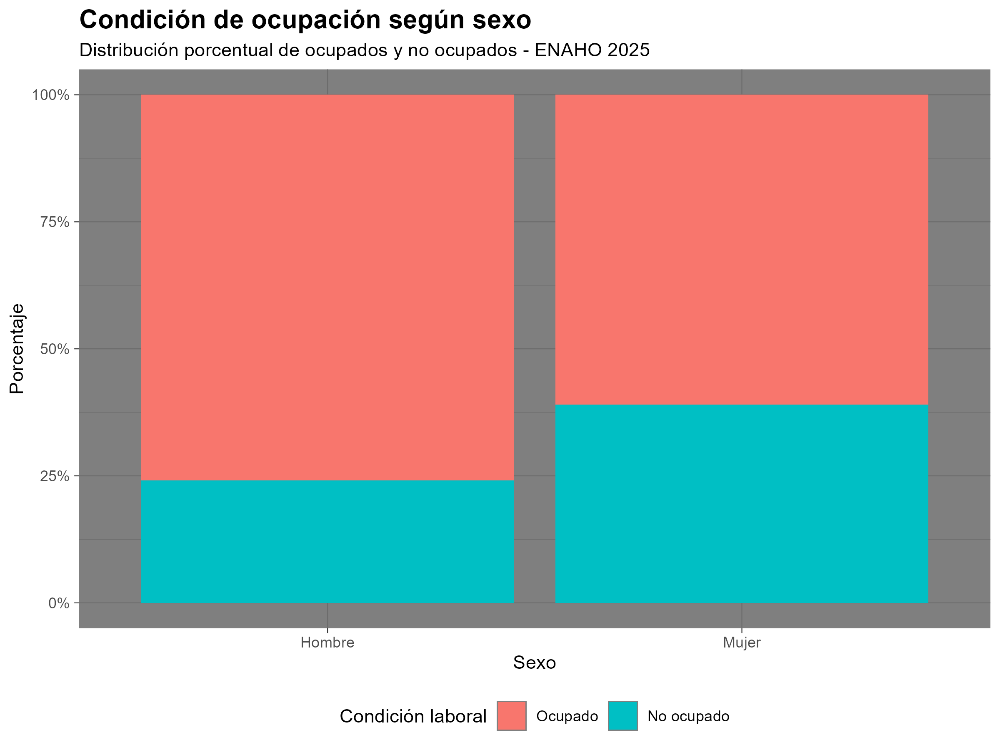
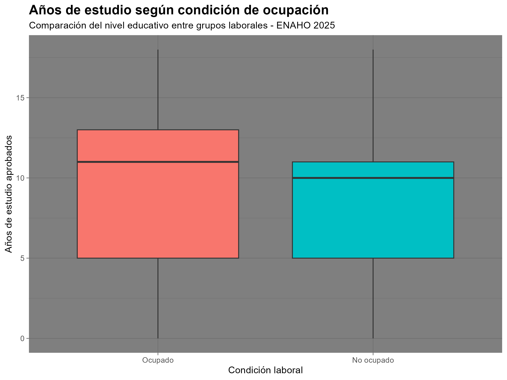
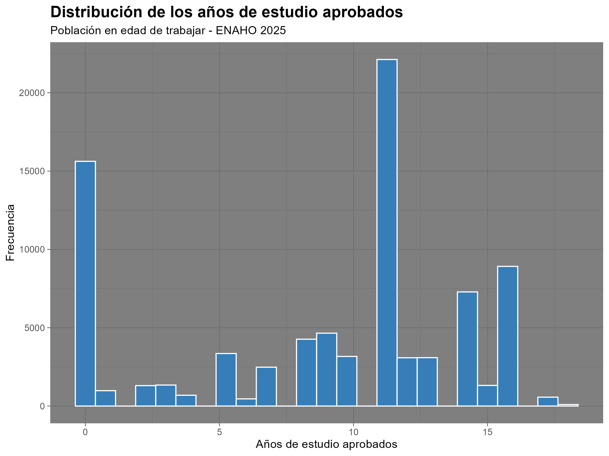
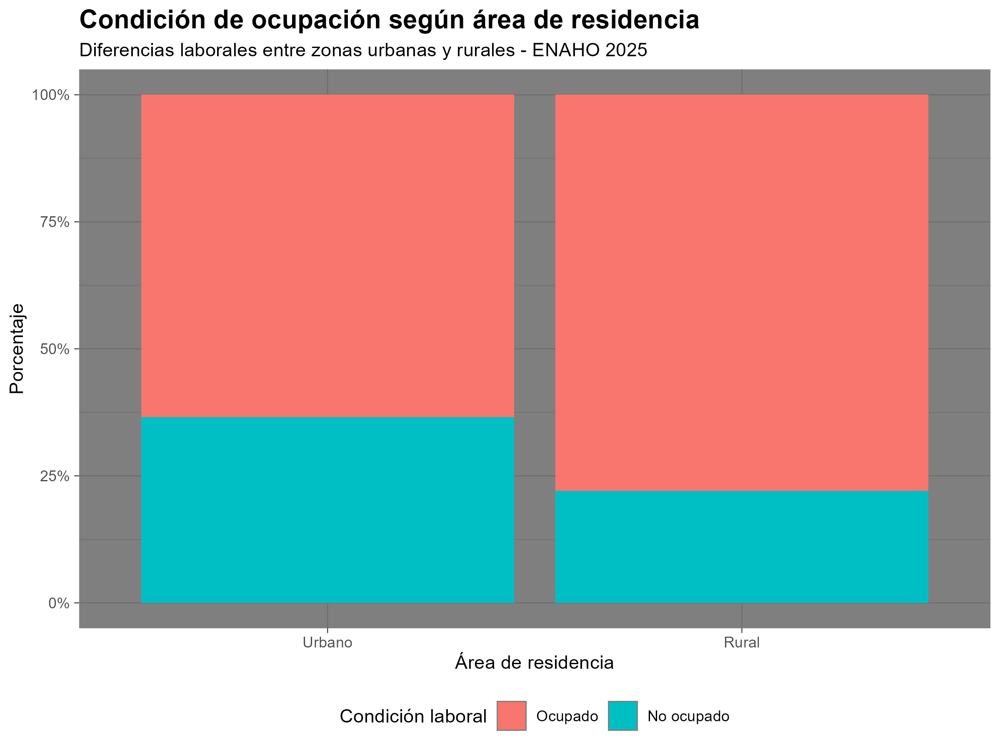
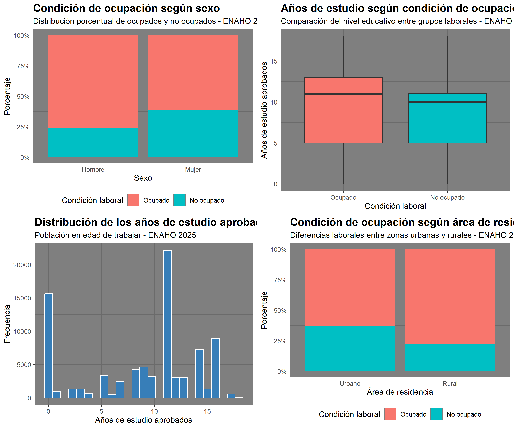
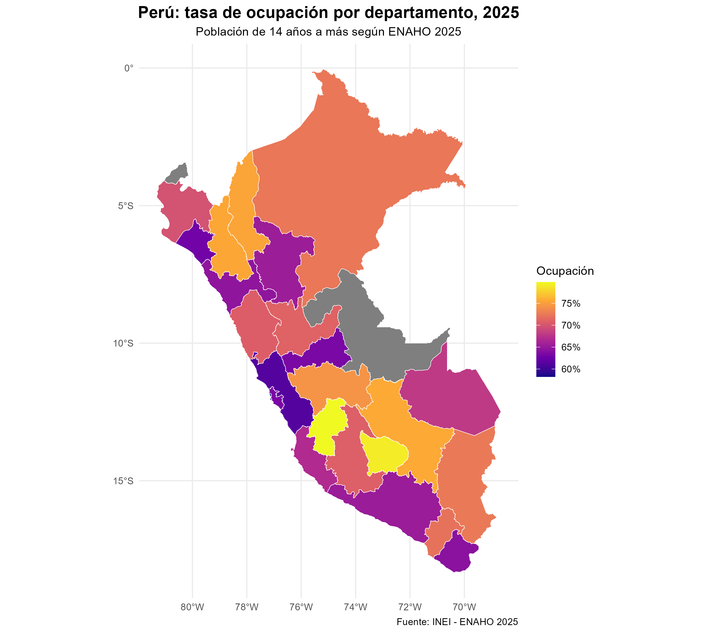
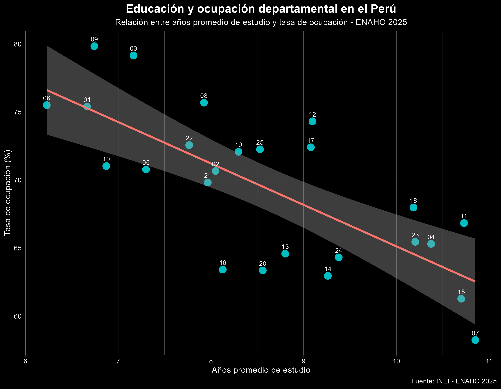

# Proyecto Final - Análisis Exploratorio y Análisis Final de ENAHO 2025

## Mercado laboral y educación en el Perú: ENAHO 2025

Este proyecto desarrolla un análisis exploratorio de datos (EDA) y un análisis complementario utilizando información de la Encuesta Nacional de Hogares (ENAHO) 2025 elaborada por el Instituto Nacional de Estadística e Informática (INEI) del Perú.

El objetivo principal es analizar las características educativas y laborales de la población peruana en edad de trabajar, identificando diferencias según características demográficas, territoriales y educativas.

---

# PARTE 1: Análisis Exploratorio de Datos (EDA)

## 1. Contexto del conjunto de datos

La fuente de información utilizada es la Encuesta Nacional de Hogares (ENAHO), elaborada por el Instituto Nacional de Estadística e Informática (INEI).

La ENAHO tiene como finalidad recopilar información sobre las condiciones socioeconómicas de los hogares peruanos, permitiendo estudiar aspectos relacionados con educación, empleo, características demográficas y ubicación geográfica.

Para este proyecto se utilizaron los siguientes módulos de ENAHO 2025:

- **Módulo 200:** características demográficas de las personas.
- **Módulo 300:** información educativa.
- **Módulo 500:** características del empleo.
- **SUMARIA:** información del hogar y ubicación geográfica.

Las principales variables analizadas fueron:

- Edad.
- Sexo.
- Nivel educativo.
- Años de estudios aprobados.
- Condición de ocupación.
- Área de residencia (urbano/rural).
- Departamento.

---

# 2. Importación y preparación de datos

Las bases fueron importadas utilizando el lenguaje R mediante el paquete `haven`, permitiendo trabajar con archivos en formato `.dta`.

Posteriormente se realizó la integración de los módulos mediante las variables identificadoras:

- Conglomerado.
- Vivienda.
- Hogar.
- Código de persona.

Las principales transformaciones realizadas fueron:

- Renombramiento de variables para facilitar el análisis.
- Construcción de la variable **años de estudio aprobados**.
- Recodificación de sexo.
- Creación de la variable urbano/rural.
- Construcción de la condición laboral ocupado/no ocupado.
- Filtrado de la población en edad de trabajar (14 años a más).

---

# 3. Estadísticas descriptivas

Luego del proceso de limpieza y preparación de datos, la base final quedó conformada por **84 784 observaciones** y **14 variables**, correspondientes a la población de 14 años a más incluida en la ENAHO 2025.

Se realizaron estadísticas descriptivas sobre las principales variables demográficas, educativas y laborales.

## Características demográficas

Respecto al sexo de la población analizada, se observa una distribución relativamente equilibrada:

- El **52.41% corresponde a mujeres** (44 434 observaciones).
- El **47.59% corresponde a hombres** (40 350 observaciones).

Esto muestra una ligera mayor participación femenina dentro de la población en edad de trabajar considerada en la muestra.

## Condición laboral

En relación con la situación ocupacional:

- El **68.05% de la población se encuentra ocupada** (57 695 personas).
- El **31.95% corresponde a población no ocupada** (27 089 personas).

Estos resultados muestran que aproximadamente dos tercios de la población analizada participan activamente en el mercado laboral.

## Área de residencia

Según el área geográfica:

- El **68.10% reside en zonas urbanas** (57 735 personas).
- El **31.90% pertenece al área rural** (27 049 personas).

La distribución evidencia una mayor concentración de la población en zonas urbanas, característica consistente con la estructura demográfica del Perú.

## Distribución de edad

La edad promedio de la población analizada fue de **43.58 años**, con una desviación estándar de **19.84 años**.

Los principales estadísticos fueron:

- Edad mínima: **14 años**.
- Primer cuartil: **26 años**.
- Mediana: **42 años**.
- Tercer cuartil: **59 años**.
- Edad máxima: **98 años**.

La mediana indica que la mitad de la población tiene 42 años o menos, mientras que existe una amplia dispersión debido a la inclusión de personas adultas mayores dentro del análisis.

## Años de estudio aprobados

La variable educativa muestra que los años promedio de estudio aprobados fueron de **8.86 años**, con una desviación estándar de **5.33 años**.

Los principales resultados fueron:

- Valor mínimo: **0 años de estudio**.
- Primer cuartil: **5 años**.
- Mediana: **11 años**.
- Tercer cuartil: **13 años**.
- Valor máximo: **18 años**.

La mediana de 11 años indica que una proporción importante de la población alcanza aproximadamente niveles cercanos a la educación secundaria completa, aunque existen diferencias importantes entre individuos.

En conjunto, las estadísticas descriptivas muestran una población predominantemente urbana, con una participación laboral mayoritaria y con diferencias relevantes en los niveles educativos alcanzados. Estos resultados permiten establecer una base inicial para analizar posteriormente las relaciones entre educación, empleo y características territoriales.

---

# 4. Visualización de datos

Se construyeron gráficos utilizando la librería `ggplot2`, aplicando criterios de visualización como títulos, subtítulos, etiquetas de ejes y leyendas.

## Condición de ocupación según sexo

## Años de estudio según condición laboral

## Distribución de años de estudio aprobados

## Condición de ocupación según área de residencia

## Collage de gráficos exploratorios

---

# PARTE 2: Análisis Final

## Pregunta de análisis

**¿Existe una relación entre el nivel educativo promedio y la tasa de ocupación entre los departamentos del Perú durante 2025?**

---

# 1. Motivación del análisis

Durante el análisis exploratorio se identificaron diferencias en la condición laboral según características educativas y territoriales.

A partir de estos hallazgos, se realizó un análisis departamental para evaluar la relación entre el nivel educativo promedio y la tasa de ocupación en las regiones del Perú.

---

# 2. Análisis territorial del mercado laboral

Se construyó un indicador departamental de la tasa de ocupación utilizando la población de 14 años a más incluida en ENAHO 2025.

Asimismo, se elaboró un mapa del Perú para identificar diferencias territoriales en la participación laboral.

## Tasa de ocupación por departamento

El mapa evidencia diferencias importantes en la tasa de ocupación entre departamentos, mostrando que la dinámica laboral presenta características distintas según la estructura económica y productiva de cada región.

---

# 3. Relación entre educación y ocupación departamental

Para complementar el análisis se evaluó la relación entre los años promedio de estudio y la tasa de ocupación departamental.

## Educación promedio y tasa de ocupación

El análisis encontró una correlación negativa entre ambas variables:

**Coeficiente de correlación: -0.74**

Este resultado no implica que una mayor educación reduzca las oportunidades laborales. Por el contrario, refleja diferencias en la estructura económica regional.

Los departamentos con mayores niveles educativos pueden presentar procesos de transición hacia empleos más especializados, mayor permanencia en formación educativa o características productivas distintas respecto a otras regiones.

---

# 4. Conclusiones finales

El análisis de ENAHO 2025 permitió identificar diferencias importantes en el mercado laboral peruano desde una perspectiva territorial y educativa.

Los resultados muestran que la tasa de ocupación varía considerablemente entre departamentos, evidenciando la influencia de factores económicos y regionales.

Asimismo, la relación entre educación y ocupación debe interpretarse considerando las características estructurales de cada región, debido a que un mayor nivel educativo no necesariamente se traduce inmediatamente en mayores tasas de ocupación.

En conjunto, los resultados resaltan la importancia de analizar el mercado laboral peruano considerando tanto factores educativos como diferencias territoriales.

---

# Estructura del proyecto
